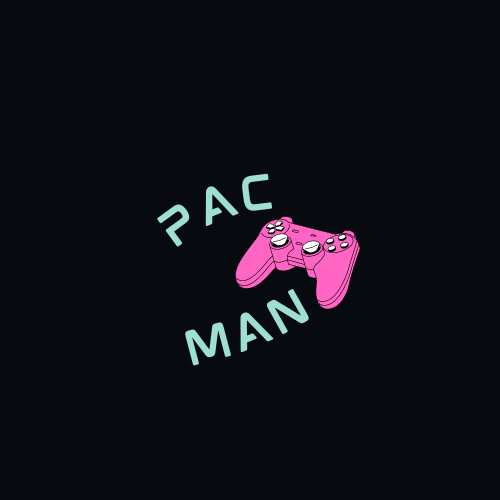

# Pac-Man
Final Project of Basic Programming Course at Shahid Beheshti University (Winter 2022)

Score: 830 out of 600 [230 extra points]

Course Instructor: [Dr. Kheradpisheh](https://github.com/SRKH)

Team Mentor: [Mobin Nesari](https://github.com/MobinNesari81)

My Teammate: [Mahla Entezari](https://github.com/MahlaEn)

  

## Introductions
This is a C++ program that implements Pac-Man game!

- The program includes several libraries, including SFML and bits/stdc++.h, which are used throughout the code.
- It defines several constants, including the maximum size of the game board (maxn), the value for infinity (INF), and arrays and variables used throughout the program, a function called to_int that converts a string to an integer, an enum called Direction that represents the possible directions that the player can move in, a struct called ghost that represents the position of a ghost in the game,  a main function that initializes the game board, sets up the player and ghost positions, and handles user input and game logic. The game board is displayed using SFML graphics.
- The game allows the player to move around the board, collecting points and avoiding ghosts. If the player collides with a ghost, they lose a life. If the player loses all their lives, the game is over. The player wins the game by collecting all the points on the board.

## Functions
- The save function saves the current state of the game to a file named "Game.txt". It writes the values of n, m, Ip, Jp, Ich, Jch, ghost positions, and the game board to the file.

- The load function loads the saved state of the game from the "Game.txt" file. It reads the values of n, m, Ip, Jp, Ich, Jch, ghost positions, and the game board from the file and sets them to their respective variables.

-  The RandCherry function randomly places a cherry on the game board. It selects a random location from the vector path and sets the cherry position to that location.

-  The dfs function performs a depth-first search on the game board to find all the valid paths that the player can take. It populates the vector path with the indices of the valid paths.

-  The check function checks if the current position of the player is valid or not. It uses the dfs function to find all valid paths that the player can take.

-  The make_map function generates a random map for the game. It randomly places walls on the game board and connects all the cells to create a connected graph. It also sets the player and ghost positions on the game board.

-  The Print function prints the game board on the console. It uses colored ASCII characters to represent different elements on the game board, such as the player, ghosts, walls, and points.

-  The isGhost function checks if the player is colliding with a ghost or not. If the player is colliding with a ghost, it decreases the player's chance by 1 and sets the player position to the starting position. If the player has no remaining chances, it sets the GameOver flag to true.

- The MoveGhost function moves the ghosts on the game board based on their current direction. It checks if the next cell in the current direction is empty or contains a dot, and then moves the ghost to that cell if it is valid.

- The bfs function performs a breadth-first search on the game board to find the shortest path from the current position of Pac-Man to each cell on the game board.

- The MoveGPro function moves the ghosts towards Pac-Man. It first calls the bfs function to find the shortest path from Pac-Man to each ghost, and then sets the direction of each ghost based on the next cell in the shortest path.

- The Dir function checks if any arrow keys are pressed and sets the direction of Pac-Man accordingly.

- The MovePacman function moves Pac-Man on the game board based on the current direction. It checks if the next cell in the current direction is empty or contains a dot, and then moves Pac-Man to that cell if it is valid. It also checks if Pac-Man collides with a ghost or if Pac-Man reaches the cherry, and takes appropriate actions.
  
- The MoveTime function moves Pac-Man and the ghosts based on the elapsed time since the start of the game. It checks if a certain amount of time has passed since the last move, and then moves Pac-Man and the ghosts accordingly.

- The Move function moves Pac-Man and the ghosts one step at a time, and then waits for a short period before moving again. This function is used to animate the movement of Pac-Man and the ghosts on the game board.

- The main function sets up the window for the game and runs a loop that handles user input, updates the game board, and draws the game board on the window. The loop runs until the user closes the window.

## Overall
Overall, these functions in combination are used to implement a basic version of the Pac-Man game where the player controls Pac-Man using arrow keys, and the ghosts move towards Pac-Man using the shortest path algorithm. The game board contains dots that Pac-Man can eat to increase the score, and a cherry that Pac-Man can eat to temporarily gain invincibility. The game ends when Pac-Man collides with a ghost and loses all chances!
